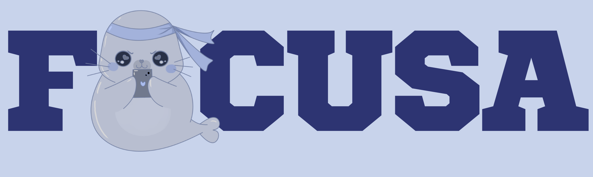

**Focusa** es una aplicación web SaaS pensada para cualquier persona que quiera **gestionar mejor su tiempo y sus tareas**.  
Con una interfaz simple e intuitiva, busca ayudarte a cumplir plazos, organizar prioridades y visualizar tu progreso de forma clara.

-----

## 📌 Relevancia del Proyecto

Muchas personas tienen dificultades para manejar sus tareas del día a día:  
- Olvidan compromisos importantes.  
- No saben en qué invierten su tiempo.  
- Pierden plazos al no tener un sistema de organización.  

🚀 **Focusa** surge para resolver este problema y convertirse en una herramienta práctica para **mejorar la productividad personal**.

---

## ⚙️ Características

- ✅ Crear tareas con fechas límite y niveles de prioridad.  
- ✅ Agrupar tareas por proyectos o categorías.  
- ✅ Generar alertas y recordatorios.  
- ✅ Visualizar estadísticas de uso del tiempo (día, semana o proyecto).  
- ✅ Sincronización con Google Calendar o exportación de datos en CSV.  

---

## 🚀 Beneficios

- Mejora la **organización personal**.  
- Entrena habilidades en **gestión del tiempo**.  
- Puede ser utilizada por estudiantes, profesionales o cualquier persona que busque ser más productiva.  
